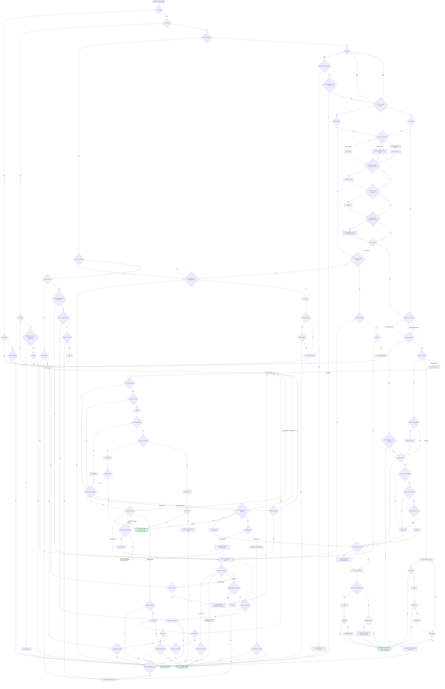

# Kael's Decision Flowchart

```mermaid
flowchart TD
    START(["Kael encounters a creature"]) --> ALIVE{"01 - Is it alive?"}

    ALIVE -->|No| UH{"Is it hostile?"}
    UH -->|Yes| KILLINTENT
    UH -->|No| NEED{"Does it need killing?"}
    NEED -->|Yes| KILLINTENT
    NEED -->|No| E5

    ALIVE -->|Yes| HUM{"Is it humanoid?"}
    HUM -->|No| NH{"Is it hostile?"}
    NH -->|Yes| KILLINTENT
    NH -->|No| PERFORMANCE{"Would people find it cute or interesting in a performance?"}
    PERFORMANCE -->|Yes| TRAIN["Catch and train it"]
    TRAIN --> E3
    PERFORMANCE -->|No| FOOD{"Is it food?"}
    FOOD -->|Yes| KILLINTENT
    FOOD -->|No| E5

    HUM -->|Yes| FEMALE{"Does it look female?"}
    FEMALE -->|No| OTHERHOST
    FEMALE -->|Yes| AGE{"Age group?"}

    AGE -->|Minor| CHILD{"Could she be Kael's child?"}
    CHILD -->|Yes| PRINCESS["Treat her like a young princess"]
    PRINCESS --> E3
    CHILD -->|No| WAITADULT{"Encountered again as an adult?"}
    WAITADULT -->|No, not yet| E5
    WAITADULT -->|Yes| PM

    AGE -->|Adult| PM
    AGE -->|Elder| PM

    PM{"02 - Is she a party member?"}
    PM -->|Yes| FIRST{"First meeting?"}
    FIRST -->|Yes| BODY
    FIRST -->|No| PARTYHOST
    PM -->|No| ELDERQ{"Is she elderly?"}
    ELDERQ -->|Yes| STATUS
    ELDERQ -->|No| BODY

    BODY{"03 - What's her body type?"}
    BODY -->|Thicc or athletic| GOD["God damn!"]
    BODY -->|Busty or curvy| EYES["Struggles to maintain eye contact"]
    BODY -->|Plus-size, petite, slim or muscular| NOTUSUAL["Not my usual, but..."]

    GOD --> ALT
    EYES --> ALT
    NOTUSUAL --> ALT

    ALT{"Alternative aesthetic, tattoos or piercings?"}
    ALT -->|Yes| HOT["Damn, she's hot."]
    ALT -->|No| DOM
    HOT --> DOM

    DOM{"Strong or dominant personality?"}
    DOM -->|Yes| MOM["....Mommy?"]
    DOM -->|No| BOTH
    MOM --> BOTH

    BOTH{"Both aesthetic and personality preferences?"}
    BOTH -->|Yes| GOOD["I'll be a good boy... unless you don't want me to?"]
    BOTH -->|No| TASTEDONE
    GOOD --> TASTEDONE

    TASTEDONE{"Party member?"}
    TASTEDONE -->|Yes, no flirting| PARTYHOST
    TASTEDONE -->|No| STATUS

    STATUS{"Does she seem single?"}
    STATUS -->|Yes, remember single| EMP
    STATUS -->|No, remember partnered| EMP

    EMP{"Is she his employer?"}
    EMP -->|Yes| RISK{"Worth risking income or reputation?"}
    RISK -->|No| MONEY["Need the money to flirt with other women"]
    MONEY --> E5
    RISK -->|Yes| RELSTATUS
    EMP -->|No| WOMANHOST

    WOMANHOST{"04 - Is she hostile?"}
    WOMANHOST -->|No| MET{"Has he met her before?"}
    MET -->|No| INTRO["Introduce himself"]
    MET -->|Yes| RELSTATUS
    INTRO --> RELSTATUS

    WOMANHOST -->|Just angry| CALM
    WOMANHOST -->|Trying to kill him| SPAREINTENT

    PARTYHOST{"Is this party member hostile?"}
    PARTYHOST -->|No| FRIEND
    PARTYHOST -->|Yes| PANN{"Are they annoying?"}
    PANN -->|No| RECON
    PANN -->|Yes| URARA{"Is it Urara?"}
    URARA -->|No| RECON
    URARA -->|Yes| UMOCK["Cast Vicious Mockery"]
    UMOCK --> KILLINTENT

    OTHERHOST{"04 - Are they hostile?"}
    OTHERHOST -->|No| FRIEND
    OTHERHOST -->|Yes| ACTIVELY{"Trying to kill Kael?"}

    ACTIVELY -->|Yes| OPM{"Party member?"}
    OPM -->|Yes| RECON
    OPM -->|No| KILLINTENT
    ACTIVELY -->|No| BENEFIT{"Kael's fault or beneficial relationship?"}
    BENEFIT -->|Yes| RECON
    BENEFIT -->|No| STRONG{"Likely stronger than Kael?"}
    STRONG -->|Yes| WAIT
    STRONG -->|No| MIGHTKILL{"Might they kill him?"}
    MIGHTKILL -->|Yes| PREMOCK["Cast Vicious Mockery first"]
    MIGHTKILL -->|No| ATTACK["Attack"]
    PREMOCK --> KILLINTENT
    ATTACK --> KILLINTENT

    FRIEND{"10 - Advantage to befriending them?"}
    FRIEND -->|Yes| E3
    FRIEND -->|No| POLITE["Be polite"]
    POLITE --> ANNOY{"Are they annoying?"}
    ANNOY -->|Yes| APARTY{"Party member?"}
    APARTY -->|Yes| E5
    APARTY -->|No| SOCIALMOCK
    ANNOY -->|No| SOCIALMOCK
    SOCIALMOCK["Cast Vicious Mockery"] --> KILLINTENT

    CALM["05 - Try calming her down"] --> CW{"Did it work?"}
    CW -->|Yes| E1
    CW -->|No| GROVEL["Grovel"]
    GROVEL --> GW{"Did it work?"}
    GW -->|Yes| E1
    GW -->|No| HARDER["Flirt harder"]
    HARDER --> HW{"Did it work?"}
    HW -->|Yes| E1
    HW -->|No| CALM

    RECON["06 - Try resolving the conflict"] --> RR{"How do they respond?"}
    RR -->|Reconciled| RB{"Relationship beneficial?"}
    RB -->|Yes| E3
    RB -->|No| E5

    RR -->|Hostility ends without friendship| E5
    RR -->|Still hostile| SAVE{"Relationship worth saving?"}
    SAVE -->|Yes| HARDRECON["Try harder"]
    HARDRECON --> RECON
    SAVE -->|No| CANKILL{"Can Kael defeat them?"}
    CANKILL -->|Yes| PREMOCK
    CANKILL -->|No| WAIT

    RR -->|Physically attacks| STILLWORTH{"Still worth saving?"}
    STILLWORTH -->|Yes| DEFENDINTENT
    STILLWORTH -->|No| KILLINTENT

    WAIT["Wait a period of time"] --> STILLHOST{"Still hostile?"}
    STILLHOST -->|No| IMPROVED{"Relationship improved?"}
    IMPROVED -->|Yes| E3
    IMPROVED -->|No| E5

    STILLHOST -->|Yes| ATTACKING{"Actively attacking Kael?"}
    ATTACKING -->|Yes| KILLINTENT
    ATTACKING -->|No| NOWWIN{"Can Kael defeat them now?"}
    NOWWIN -->|Yes| PREMOCK
    NOWWIN -->|No| WAIT

    RELSTATUS{"Is she partnered?"}
    RELSTATUS -->|No| INIT
    RELSTATUS -->|Yes| NEAR

    NEAR{"13 - Is her partner nearby?"}
    NEAR -->|No| OPENFLIRT
    NEAR -->|Yes| THREAT{"Could her partner kill Kael?"}
    THREAT -->|No| OPENFLIRT
    THREAT -->|Yes| CARE{"Does their partner care?"}
    CARE -->|Yes| SUBTLE["Flirt subtly"]
    CARE -->|No| OPENFLIRT["Flirt openly"]
    SUBTLE --> INIT
    OPENFLIRT --> INIT

    INIT{"Did she initiate flirting?"}
    INIT -->|Yes| SUSPECT["Why the hell is she interested in ME?"]
    INIT -->|No| FLIRT
    SUSPECT --> FLIRT

    FLIRT["11 - Flirt or reciprocate"] --> RESPONSE{"Did she respond positively?"}
    RESPONSE -->|Yes| PANIC
    RESPONSE -->|No| ELDERREJECT{"Elderly woman?"}
    ELDERREJECT -->|Yes| RESPECT["Keep flirting respectfully without expectations"]
    ELDERREJECT -->|No| E1
    RESPECT --> E1

    PANIC["12 - PANIC!"] --> TRAP{"Is it a trap?"}
    TRAP -->|Yes| E1
    TRAP -->|No| PROBABLY["It's probably a trap"]
    PROBABLY --> E1

    KILLINTENT["08 - Fight to kill"] --> BATTLE
    SPAREINTENT["08 - Try not to kill her"] --> BATTLE
    DEFENDINTENT["08 - Defend without abandoning reconciliation"] --> BATTLE

    BATTLE["Enter combat"] --> LETHAL{"07 - Potentially lethal?"}
    LETHAL -->|No| MODE
    LETHAL -->|Yes| DYING{"Is Kael about to die?"}
    DYING -->|No| MODE
    DYING -->|Yes| SURVPANIC["PANIC!"]

    SURVPANIC --> SELF{"Can he heal himself?"}
    SELF -->|Yes| HEAL["Heal himself"]
    HEAL --> MODE
    SELF -->|No| OTHERS{"Can anyone else heal?"}
    OTHERS -->|Yes| BEGHELP["Beg for help"]
    BEGHELP --> HEALED{"Did they heal him?"}
    HEALED -->|Yes| MODE
    HEALED -->|No| E2
    OTHERS -->|No| MERCY["Beg for mercy"]
    MERCY --> MW{"Did it work?"}
    MW -->|No| E2
    MW -->|Yes| SERVANT["Feign servitude and seek escape"]
    SERVANT --> E5

    MODE{"Resume combat objective"}
    MODE -->|Kill| COMBATOUT
    MODE -->|Spare woman| SPAREOUT
    MODE -->|Defend and reconcile| DEFENDOUT

    DEFENDOUT{"Safely disengaged?"}
    DEFENDOUT -->|Yes| RECON
    DEFENDOUT -->|No| BATTLE

    COMBATOUT{"Combat outcome?"}
    COMBATOUT -->|Opponent killed| E4
    COMBATOUT -->|Kael dies| E2
    COMBATOUT -->|Opponent surrenders| SURRENDER
    COMBATOUT -->|Opponent flees| FLEE
    COMBATOUT -->|Fight continues| BATTLE

    SURRENDER{"Relationship worth saving?"}
    SURRENDER -->|Yes| ACCEPT["Accept surrender"]
    ACCEPT --> RECON
    SURRENDER -->|No| E4

    FLEE{"Reason to kill them?"}
    FLEE -->|No| E5
    FLEE -->|Yes| PURSUE["Pursue them"]
    PURSUE --> CAUGHT{"Caught them?"}
    CAUGHT -->|Yes| BATTLE
    CAUGHT -->|No| KEEPLOOKING{"Need to keep looking?"}
    KEEPLOOKING -->|Yes| PURSUE
    KEEPLOOKING -->|No| E5

    SPAREOUT{"09 - Did she survive combat?"}
    SPAREOUT -->|Yes| AGAIN["Try flirting again"]
    AGAIN --> INIT
    SPAREOUT -->|Kael dies| E2
    SPAREOUT -->|Fight continues| BATTLE
    SPAREOUT -->|No| KILLER{"Who killed her?"}

    KILLER -->|Kael accidentally| GUILT["Guilty about losing his chance at love"]
    GUILT --> E4
    KILLER -->|Someone else| ANNOYED["Quietly annoyed with them"]
    ANNOYED --> WHOANNOY{"Annoying party member?"}
    WHOANNOY -->|Yes| E5
    WHOANNOY -->|No| E3

    E1(["E1 - KEEP FLIRTING, IT MIGHT STILL WORK"])
    E2(["E2 - PREPARE NEW CHARACTER SHEET"])
    E3(["E3 - NEW BESTIE!"])
    E4(["E4 - KILL THEM"])
    E5(["E5 - TOLERATE THEM"])

    classDef ending fill:#e6f4e8,stroke:#35945b,color:#164e30,stroke-width:2px
    class E1,E2,E3,E4,E5 ending
```
